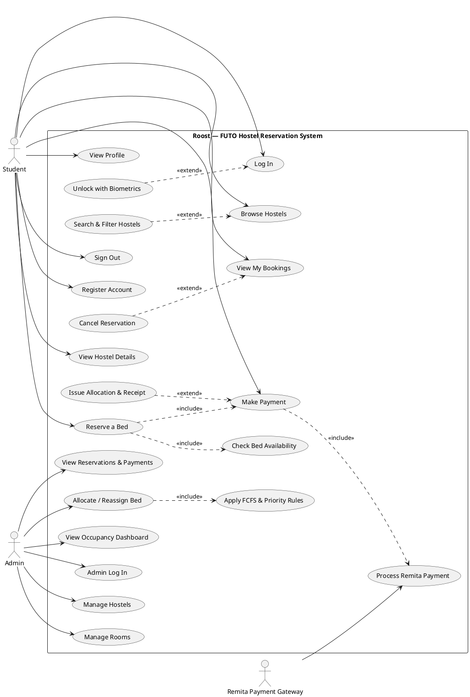

# 1 — Use Case Diagram

**Purpose:** the functional scope of Roost — who (actors) can do what (use cases),
and how the use cases relate (`«include»`, `«extend»`, generalization).

## Actors

| Actor | Type | Role |
|---|---|---|
| **Student** | Primary | Uses the mobile app: sign in, browse, reserve, pay, view/cancel bookings. |
| **Admin** | Primary | Student-Affairs officer on the web dashboard: manage hostels/rooms, view reservations, allocate beds, see occupancy. |
| **Remita Payment Gateway** | Supporting (secondary, external) | Issues the RRR and confirms payment (webhook). Drawn on the **right** as an external actor. |

## Use cases

| ID | Use case | Actor | One-line meaning |
|---|---|---|---|
| U1 | Register Account | Student | Create an account (reg-no/email + password). |
| U2 | Log In | Student | Authenticate with identifier + password. |
| U3 | Unlock with Biometrics | Student | Face ID / fingerprint unlock (alternative to U2). |
| U4 | Browse Hostels | Student | See all hostels with gender, price, availability. |
| U5 | Search & Filter Hostels | Student | Search by name/funder; filter by gender/availability. |
| U6 | View Hostel Details | Student | Cover, rooms, beds, location, blurb. |
| U7 | Reserve a Bed | Student | Hold a specific bed in a room. |
| U7a | Check Bed Availability | (system) | Verify the bed is free + one-active-reservation rule. |
| U8 | Make Payment | Student | Pay the hostel fee. |
| U9 | Process Remita Payment | Remita | Generate RRR, take payment, confirm via webhook. |
| U10 | Issue Allocation & Receipt | (system) | Produce reference + e-receipt + allocation. |
| U11 | View My Bookings | Student | List reservations + history. |
| U12 | Cancel Reservation | Student | Cancel a paid booking (frees the bed). |
| U13 | View Profile | Student | Identity, current stay, appearance, sign out. |
| U14 | Sign Out | Student | End the session. |
| U15 | Admin Log In | Admin | Authenticate to the dashboard. |
| U16 | Manage Hostels | Admin | Create / update / delete hostels. |
| U17 | Manage Rooms | Admin | Create / update / delete room types. |
| U18 | View Reservations & Payments | Admin | See all bookings + payment status. |
| U19 | Allocate / Reassign Bed | Admin | Manually place or move a student's bed. |
| U19a | Apply FCFS & Priority Rules | (system) | First-come-first-serve, 100-level & final-year priority. |
| U20 | View Occupancy Dashboard | Admin | Beds filled vs free per hostel + revenue. |

## Relationships (the part that must be exact)

**Associations** (solid line, actor ↔ base use case):

- Student — U1, U2, U4, U6, U7, U8, U11, U13, U14
- Admin — U15, U16, U17, U18, U19, U20
- Remita Payment Gateway — U9

**`«include»`** (dashed arrow, **base → included**; the included behaviour is
*always* performed as part of the base):

| Base | includes | Why |
|---|---|---|
| U7 Reserve a Bed | U7a Check Bed Availability | every reservation first checks the bed + active-booking rule |
| U7 Reserve a Bed | U8 Make Payment | an allocation is only granted once paid — the app does reserve→pay as one transaction |
| U8 Make Payment | U9 Process Remita Payment | payment always runs through Remita (RRR) |
| U19 Allocate / Reassign Bed | U19a Apply FCFS & Priority Rules | allocation always applies the ordering rules |

**`«extend»`** (dashed arrow, **extension → base**; optional/conditional):

| Extension | extends base | Condition |
|---|---|---|
| U3 Unlock with Biometrics | U2 Log In | `[biometrics enrolled & previously signed in]` |
| U5 Search & Filter Hostels | U4 Browse Hostels | `[user narrows the list]` |
| U12 Cancel Reservation | U11 View My Bookings | `[booking is PAID and before deadline]` |
| U10 Issue Allocation & Receipt | U8 Make Payment | `[payment verified]` |

**Generalization** *(optional refinement, if your rubric wants it):* introduce an
abstract actor **User** and let `Student ▷ User` and `Admin ▷ User` (hollow
triangle to User), factoring a shared **Authenticate** use case. Keep the note
that Student authenticates via the student endpoint and Admin via the admin
endpoint. The main diagram below keeps them separate for clarity.

## Layout

- One **system boundary** rectangle titled *"Roost — FUTO Hostel Reservation
  System"* containing all ellipses.
- **Student** actor on the **left**; **Admin** actor on the **right**; **Remita**
  actor lower-right (external).
- Cluster Student use cases (U1–U14) toward the left half, Admin use cases
  (U15–U20) toward the right half; U9 near Remita.
- Draw `«include»`/`«extend»` as **dashed** arrows with the stereotype label; keep
  association lines solid and unlabeled.

## Renderable source (PlantUML)

> Common-mistake guard: an `«include»` arrow points **from the base to the
> included** use case; an `«extend»` arrow points **from the extension back to the
> base**. Do **not** connect secured use cases to "Log In" with `«include»` — login
> is a *precondition*, not an included step.
