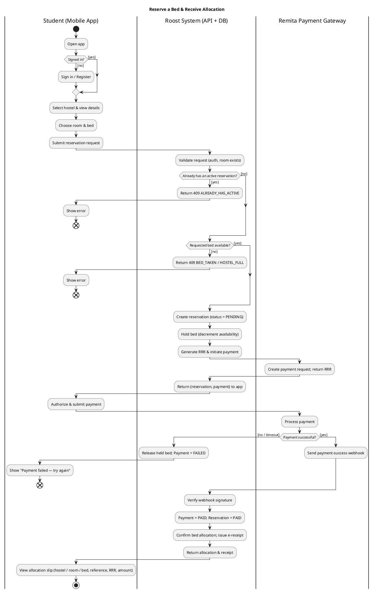
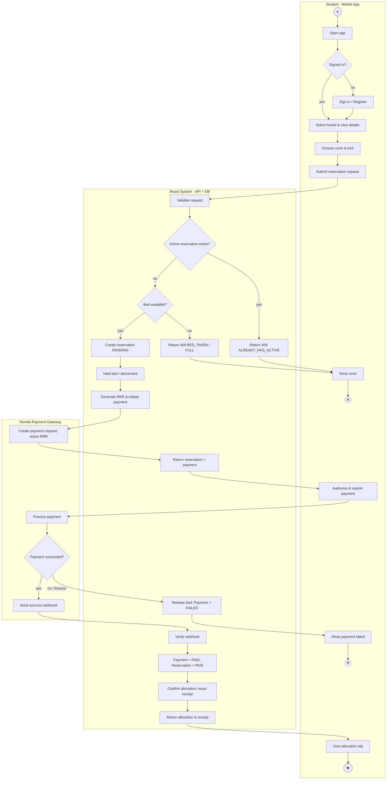

# 2 — Activity Diagram (with Swim Lanes)

**Scenario modelled:** *Reserve a Bed & Receive Allocation* — the richest flow
(auth check, availability + one-active-reservation rules, Remita payment, webhook
confirmation, allocation). This is the flow to draw; it exercises every decision.

## Swim lanes (partitions)

Three vertical lanes, left → right. Every action sits in the lane of the party
that performs it; control flow crosses lanes on the arrows.

1. **Student (Mobile App)**
2. **Roost System (API + Database)**
3. **Remita Payment Gateway**

## Node-by-node specification

`●` initial · rounded box = action · `◇` decision (guards in `[...]`) · `◉`
activity-final · `⊗` flow-final (error ends).

| Node | Lane | Type | Label | Outgoing |
|---|---|---|---|---|
| ● | Student | initial | — | → A1 |
| A1 | Student | action | Open app | → D1 |
| D1 | Student | decision | Signed in? | `[no]` → A2 · `[yes]` → A3 |
| A2 | Student | action | Sign in / Register | → A3 |
| A3 | Student | action | Select hostel & view details | → A4 |
| A4 | Student | action | Choose room & bed | → A5 |
| A5 | Student | action | Submit reservation request | → A6 |
| A6 | System | action | Validate request (auth, room exists) | → D2 |
| D2 | System | decision | Student already has an active reservation? | `[yes]` → A7 · `[no]` → D3 |
| A7 | System | action | Return `409 ALREADY_HAS_ACTIVE` | → E1 |
| D3 | System | decision | Requested bed available? | `[no]` → A8 · `[yes]` → A9 |
| A8 | System | action | Return `409 BED_TAKEN / HOSTEL_FULL` | → E1 |
| E1 | Student | action | Show error | → ⊗ |
| A9 | System | action | Create reservation (`status = PENDING`) | → A10 |
| A10 | System | action | Hold bed (decrement availability) | → A11 |
| A11 | System | action | Generate RRR & initiate payment | → A12 |
| A12 | Remita | action | Create payment request; return RRR | → A13 |
| A13 | System | action | Return `{reservation, payment}` to app | → A14 |
| A14 | Student | action | Authorize & submit payment | → A15 |
| A15 | Remita | action | Process payment | → D4 |
| D4 | Remita | decision | Payment successful? | `[no / timeout]` → A16 · `[yes]` → A18 |
| A16 | System | action | Release held bed; `Payment = FAILED` | → A17 |
| A17 | Student | action | Show "Payment failed — try again" | → ⊗ |
| A18 | Remita | action | Send payment-success webhook | → A19 |
| A19 | System | action | Verify webhook signature | → A20 |
| A20 | System | action | `Payment = PAID`; `Reservation = PAID` | → A21 |
| A21 | System | action | Confirm bed allocation; issue e-receipt | → A22 |
| A22 | System | action | Return allocation & receipt | → A23 |
| A23 | Student | action | View allocation slip (hostel/room/bed, reference, RRR, amount) | → ◉ |

**Decisions & guards** (must be mutually exclusive and complete):
`D1 [yes]/[no]`, `D2 [yes]/[no]`, `D3 [yes]/[no]`, `D4 [yes]/[no·timeout]`. Two
**flow-finals** `⊗` for the error exits, one **activity-final** `◉` for success.

## Conventions to respect

- Exactly **one initial node**; guards on **every** branch out of a decision.
- A decision `◇` splits; use a matching **merge** `◇` where branches rejoin (here
  the error branches terminate, so no merge is needed before the ends).
- Keep each action verb-first ("Create reservation", "Release held bed").
- Rules #1–#4 from the model appear as D2 (one-active), D3 (availability/FCFS),
  A10 (decrement) and A18–A21 (allocate only after payment verified).

## Renderable source — PlantUML (true swim lanes)

## Renderable source — Mermaid (fallback; lanes shown as subgraphs)

