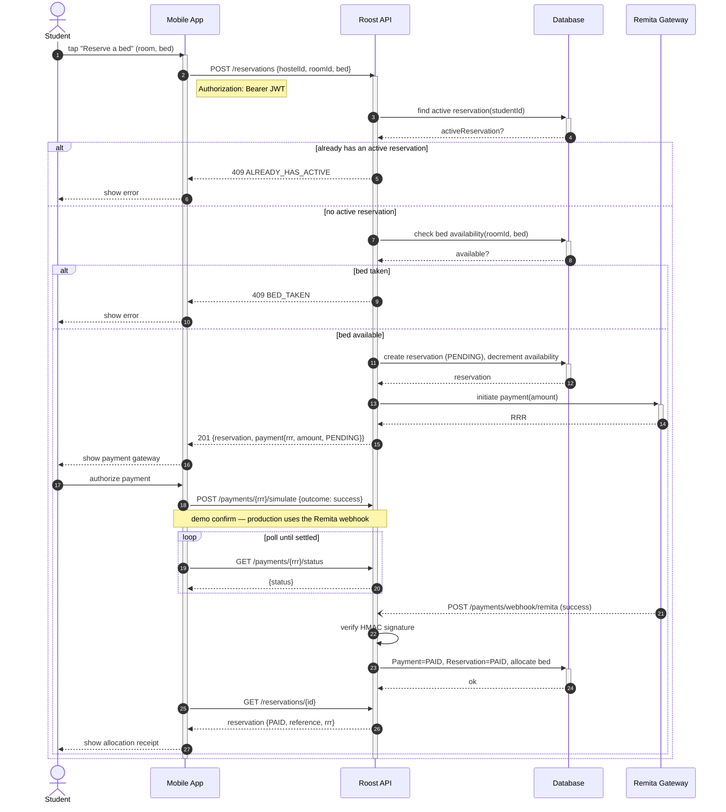
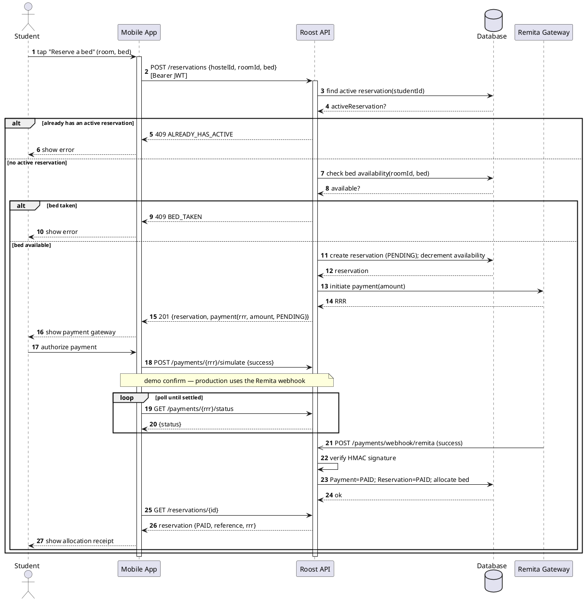

# 3 — Sequence Diagram

**Scenario modelled:** *Reserve → Pay → Allocate* — the same flow as the activity
diagram, but as a time-ordered message exchange between objects.

## Lifelines (left → right)

| Lifeline | Kind | Represents |
|---|---|---|
| **Student** | actor | The person tapping the app |
| **Mobile App** | boundary object | The Flutter client (`RoostApi`, screens) |
| **Roost API** | control object | The backend (`/api/v1`) |
| **Database** | entity object | Persistence |
| **Remita Gateway** | external system | Payment provider |

## Combined fragments used

- **`alt` (already has active reservation?)** — outer alternative; one branch
  returns `409 ALREADY_HAS_ACTIVE`, the other proceeds.
- **`alt` (bed taken?)** — nested alternative inside the "no active reservation"
  branch.
- **`loop` (poll until settled)** — the app polls `GET /payments/{rrr}/status`.
- The **webhook** from Remita is an **asynchronous** message (open arrowhead).

## Message sequence (numbered)

1. Student → Mobile App: tap **"Reserve a bed"** (room, bed)
2. Mobile App → Roost API: `POST /reservations {hostelId, roomId, bed}` — header `Authorization: Bearer JWT`
3. Roost API → Database: find active reservation(studentId)
4. Database ⇢ Roost API: activeReservation?
   - **alt [already has an active reservation]**
     5. Roost API ⇢ Mobile App: `409 ALREADY_HAS_ACTIVE`
     6. Mobile App ⇢ Student: show error
   - **else [no active reservation]**
     7. Roost API → Database: check bed availability(roomId, bed)
     8. Database ⇢ Roost API: available?
     - **alt [bed taken]**
       9. Roost API ⇢ Mobile App: `409 BED_TAKEN`
       10. Mobile App ⇢ Student: show error
     - **else [bed available]**
       11. Roost API → Database: create reservation (`PENDING`); decrement availability
       12. Database ⇢ Roost API: reservation
       13. Roost API → Remita: initiate payment(amount)
       14. Remita ⇢ Roost API: RRR
       15. Roost API ⇢ Mobile App: `201 {reservation, payment{rrr, amount, PENDING}}`
       16. Mobile App ⇢ Student: show payment gateway
       17. Student → Mobile App: authorize payment
       18. Mobile App → Roost API: `POST /payments/{rrr}/simulate {outcome: success}` *(demo confirm; prod uses the webhook)*
       - **loop [poll until settled]**
         19. Mobile App → Roost API: `GET /payments/{rrr}/status`
         20. Roost API ⇢ Mobile App: {status}
       21. Remita ⇠⇠ Roost API: `POST /payments/webhook/remita (success)` *(asynchronous)*
       22. Roost API → Roost API: verify HMAC signature *(self-message)*
       23. Roost API → Database: `Payment = PAID`; `Reservation = PAID`; allocate bed
       24. Database ⇢ Roost API: ok
       25. Mobile App → Roost API: `GET /reservations/{id}`
       26. Roost API ⇢ Mobile App: reservation {`PAID`, reference, rrr}
       27. Mobile App ⇢ Student: show allocation receipt

(`→` synchronous call, filled head · `⇢` reply, dashed open head · `⇠⇠`
asynchronous.)

## Conventions to respect

- Time flows **top → bottom**; messages are **horizontal** between lifelines.
- Draw **activation bars** on Mobile App and Roost API for the whole exchange, and
  short activations on Database/Remita around each call/return.
- A **reply** (dashed) for every synchronous **call** (solid).
- Put `[guards]` on the `alt`/`loop` fragment headers, not on the arrows.

## Renderable source — Mermaid

## Renderable source — PlantUML

