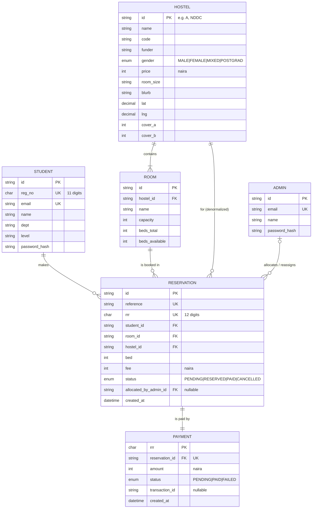

# 4 — ER Diagram / Data Model

**Purpose:** the relational schema behind the API — entities, attributes, keys,
and relationships with crow's-foot cardinality. Matches the shapes in
`docs/BACKEND-README.md §2`.

## Entities & attributes

Keys: **PK** primary, **FK** foreign, **UK** unique. Derived values (computed, not
stored) are listed separately.

### STUDENT
| Attr | Type | Key / constraint |
|---|---|---|
| id | string (uuid) | **PK** |
| reg_no | char(11) | **UK**, NOT NULL |
| email | varchar | **UK**, NOT NULL |
| name | varchar | NULL |
| dept | varchar | NULL |
| level | varchar | NULL |
| password_hash | varchar | NOT NULL (bcrypt) |

### ADMIN
| Attr | Type | Key / constraint |
|---|---|---|
| id | string (uuid) | **PK** |
| email | varchar | **UK**, NOT NULL |
| name | varchar | NULL |
| password_hash | varchar | NOT NULL |

### HOSTEL
| Attr | Type | Key / constraint |
|---|---|---|
| id | varchar | **PK** (e.g. `A`, `NDDC`) |
| name | varchar | NOT NULL |
| code | varchar | short badge (`TF`,`ND`,`PG`) |
| funder | varchar | `SCHOOL\|TETFUND\|NDDC\|POSTGRADUATE` |
| gender | enum | `MALE\|FEMALE\|MIXED\|POSTGRAD`, NOT NULL |
| price | integer | naira, NOT NULL |
| room_size | varchar | display string |
| blurb | text | |
| lat | decimal | |
| lng | decimal | |
| cover_a | integer | ARGB |
| cover_b | integer | ARGB |

*Derived (not stored):* `beds_available`, `beds_total`, `status: HostelStatus` =
sum/rollup of its rooms.

### ROOM  *(a room **type**, e.g. "8-bed room")*
| Attr | Type | Key / constraint |
|---|---|---|
| id | string (uuid) | **PK** |
| hostel_id | varchar | **FK** → HOSTEL.id, NOT NULL |
| name | varchar | NOT NULL |
| capacity | integer | beds per physical room, NOT NULL |
| beds_total | integer | NOT NULL |
| beds_available | integer | NOT NULL |

*Derived:* `status: HostelStatus`, `occupied_beds: int[]` (from active reservations).

### RESERVATION
| Attr | Type | Key / constraint |
|---|---|---|
| id | string (uuid) | **PK** |
| reference | varchar | **UK**, NOT NULL (e.g. `RST-7F3A21`) |
| rrr | char(12) | **UK**, NOT NULL |
| student_id | string | **FK** → STUDENT.id, NOT NULL |
| room_id | string | **FK** → ROOM.id, NOT NULL |
| hostel_id | varchar | **FK** → HOSTEL.id, NOT NULL *(denormalized = room.hostel_id)* |
| bed | integer | NOT NULL (1..capacity) |
| fee | integer | naira, NOT NULL |
| status | enum | `PENDING\|RESERVED\|PAID\|CANCELLED`, NOT NULL |
| allocated_by_admin_id | string | **FK** → ADMIN.id, NULL |
| created_at | timestamp | NOT NULL |

*Constraint:* a bed can't be double-booked — **unique `(room_id, bed)` among
active statuses** (`PENDING/RESERVED/PAID`).

### PAYMENT
| Attr | Type | Key / constraint |
|---|---|---|
| rrr | char(12) | **PK** (= reservation.rrr) |
| reservation_id | string | **FK** → RESERVATION.id, **UK**, NOT NULL |
| amount | integer | naira, NOT NULL |
| status | enum | `PENDING\|PAID\|FAILED`, NOT NULL |
| transaction_id | varchar | NULL (from Remita) |
| created_at | timestamp | NOT NULL |

## Relationships (cardinality + participation)

| Parent | Child | Verb | Cardinality (crow's foot) | Participation |
|---|---|---|---|---|
| HOSTEL | ROOM | contains | `1` — `1..*` (`||--|{`) | Room **total** (every room has a hostel) |
| STUDENT | RESERVATION | makes | `1` — `0..*` (`||--o{`) | Reservation **total** in Student |
| ROOM | RESERVATION | is booked in | `1` — `0..*` (`||--o{`) | Reservation **total** in Room |
| HOSTEL | RESERVATION | for *(denormalized)* | `1` — `0..*` (`||--o{`) | redundant with Room path — see note |
| RESERVATION | PAYMENT | is paid by | `1` — `1` (`||--||`) | both **total** (payment created with the reservation) |
| ADMIN | RESERVATION | allocates / reassigns | `0..1` — `0..*` (`|o--o{`) | Reservation **partial** (nullable FK) |

**Read the symbols:** `||` = exactly one, `|o` = zero-or-one, `}|` = one-or-many,
`}o` = zero-or-many. The two marks nearest an entity describe *that* entity's side.

## Renderable source — Mermaid (`erDiagram`, renders on GitHub)

## Modelling notes (so you can defend it)

- **Room = room *type*, not a physical room.** `capacity` is beds per physical
  room of that type; `beds_total` is that type's beds across the whole hostel.
- **`hostel_id` on RESERVATION is denormalized** — it equals `room.hostel_id`.
  It's stored because the app reads the hostel directly; a strict 3NF model would
  drop it and navigate RESERVATION → ROOM → HOSTEL. If your rubric penalises
  redundancy, remove the `HOSTEL ||--o{ RESERVATION` line and the `hostel_id` FK.
- **Fully-normalised alternative (optional):** replace `bed:int` +
  `occupied_beds[]` with a **BED** entity — `BED(id PK, room_id FK, bed_no,
  status)` — then `ROOM ||--|{ BED` and `BED ||--o| RESERVATION`. This removes the
  array attribute (1NF) at the cost of one more table. The implemented system uses
  the simpler `bed:int` form shown above.
- **PAYMENT keyed by `rrr`** mirrors the Remita retrieval reference and the app's
  `GET /payments/{rrr}/status`.
