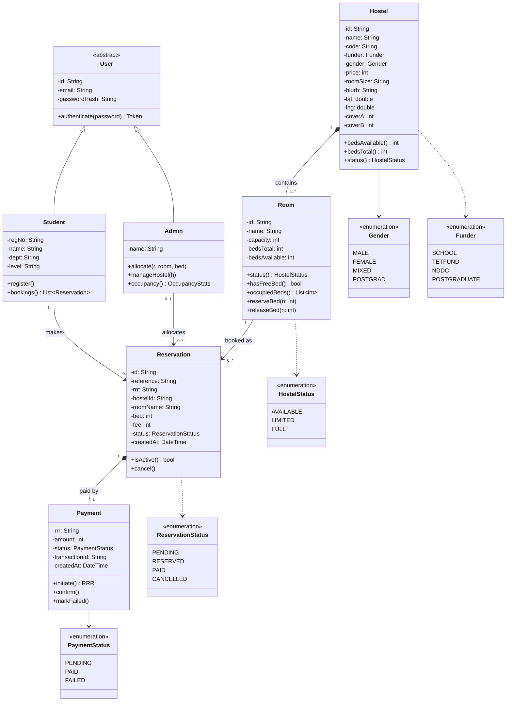

# 5 — Class Diagram

**Purpose:** the domain object model — classes with attributes **and** operations,
and every relationship correctly typed (generalization, composition, association
with multiplicities, dependency to enums). This is the diagram where relationship
mistakes cost the most, so each one is spelled out below.

## Classes (attributes + operations)

Visibility: `+` public, `-` private, `#` protected. `/derived` = computed.

| Class | Attributes | Operations |
|---|---|---|
| **User** *(abstract)* | `-id`, `-email`, `-passwordHash` | `+authenticate(password): Token {abstract}` |
| **Student** *(: User)* | `-regNo`, `-name`, `-dept`, `-level` | `+register()`, `+bookings(): List<Reservation>` |
| **Admin** *(: User)* | `-name` | `+allocate(r, room, bed)`, `+manageHostel(h)`, `+occupancy(): OccupancyStats` |
| **Hostel** | `-id`, `-name`, `-code`, `-funder: Funder`, `-gender: Gender`, `-price: int`, `-roomSize`, `-blurb`, `-lat`, `-lng`, `-coverA`, `-coverB` | `+bedsAvailable(): int /derived`, `+bedsTotal(): int /derived`, `+status(): HostelStatus /derived` |
| **Room** | `-id`, `-name`, `-capacity: int`, `-bedsTotal: int`, `-bedsAvailable: int` | `+status(): HostelStatus`, `+hasFreeBed(): bool`, `+occupiedBeds(): List<int>`, `+reserveBed(n: int)`, `+releaseBed(n: int)` |
| **Reservation** | `-id`, `-reference`, `-rrr`, `-hostelId` *(denorm.)*, `-roomName` *(denorm.)*, `-bed: int`, `-fee: int`, `-status: ReservationStatus`, `-createdAt: DateTime` | `+isActive(): bool`, `+cancel()` |
| **Payment** | `-rrr`, `-amount: int`, `-status: PaymentStatus`, `-transactionId`, `-createdAt: DateTime` | `+initiate(): RRR`, `+confirm()`, `+markFailed()` |

**Enumerations** (`«enumeration»`): `Gender {MALE,FEMALE,MIXED,POSTGRAD}` ·
`HostelStatus {AVAILABLE,LIMITED,FULL}` · `ReservationStatus
{PENDING,RESERVED,PAID,CANCELLED}` · `PaymentStatus {PENDING,PAID,FAILED}` ·
`Funder {SCHOOL,TETFUND,NDDC,POSTGRADUATE}`.

## Relationships — read this carefully

| # | Between | Kind (symbol) | Multiplicity | Role names / navigability | Meaning |
|---|---|---|---|---|---|
| R1 | Student → User | **generalization** (hollow ▷ at User) | — | — | Student **is-a** User |
| R2 | Admin → User | **generalization** (hollow ▷ at User) | — | — | Admin **is-a** User |
| R3 | Hostel ◆— Room | **composition** (filled ◆ at **Hostel**) | `1` — `1..*` | `hostel` / `rooms` | a Hostel **is composed of** Rooms; deleting the hostel deletes its rooms |
| R4 | Student —— Reservation | **association** | `1` — `0..*` | `student` / `reservations` (Student→Reservation) | a Student **makes** Reservations (≤ 1 *active*) |
| R5 | Room —— Reservation | **association** | `1` — `0..*` | `room` / `reservations` | a Reservation is **for** exactly one Room + bed |
| R6 | Reservation ◆— Payment | **composition** (filled ◆ at **Reservation**) | `1` — `1` | `reservation` / `payment` | a Reservation **owns** its Payment (created together, same `rrr`) |
| R7 | Admin —— Reservation | **association** | `0..1` — `0..*` | `allocatedBy` / `reservations` | an Admin may **allocate/reassign** a Reservation |
| R8 | Hostel ⇢ Gender, Funder | **dependency** (dashed) | — | — | attributes typed by the enums |
| R9 | Room ⇢ HostelStatus | **dependency** | — | — | `status()` returns the enum |
| R10 | Reservation ⇢ ReservationStatus | **dependency** | — | — | `status` typed by the enum |
| R11 | Payment ⇢ PaymentStatus | **dependency** | — | — | `status` typed by the enum |

**Why these kinds (so you can defend them, and not mix them up):**

- **Composition, not aggregation, for R3 & R6:** the part cannot exist without the
  whole and shares its lifecycle (a Room only exists inside a Hostel; a Payment
  only exists for its Reservation). Aggregation (hollow ◇) would wrongly imply the
  part can outlive the whole. The **filled diamond sits on the *whole* end**
  (Hostel; Reservation).
- **Association, not composition, for R4 & R7:** a Reservation is not *part of* a
  Student or Admin — it exists independently and merely references them. Use a
  plain solid line with multiplicities.
- **Multiplicity direction:** the number nearest a class is *how many of that
  class* participate. `Hostel "1" *-- "1..*" Room` = one hostel, one-or-more rooms.
- **Reservation → Hostel is *not* a separate association here** — the hostel is
  reached via `Reservation → Room → Hostel`. `hostelId`/`roomName` on Reservation
  are **denormalized** convenience attributes (mirrors the app), not new links.
- **`User` is abstract** — it is never instantiated; only Student/Admin are. Show
  the name in *italics* (or `{abstract}`).

## Renderable source — Mermaid (`classDiagram`, renders on GitHub)



## Renderable source — PlantUML

```plantuml
@startuml roost-class
skinparam classAttributeIconSize 0
hide empty members

abstract class User {
  - id : String
  - email : String
  - passwordHash : String
  + {abstract} authenticate(password) : Token
}
class Student {
  - regNo : String
  - name : String
  - dept : String
  - level : String
  + register()
  + bookings() : List<Reservation>
}
class Admin {
  - name : String
  + allocate(r, room, bed)
  + manageHostel(h)
  + occupancy() : OccupancyStats
}
class Hostel {
  - id : String
  - name : String
  - code : String
  - funder : Funder
  - gender : Gender
  - price : int
  - roomSize : String
  - blurb : String
  - lat : double
  - lng : double
  - coverA : int
  - coverB : int
  + bedsAvailable() : int
  + bedsTotal() : int
  + status() : HostelStatus
}
class Room {
  - id : String
  - name : String
  - capacity : int
  - bedsTotal : int
  - bedsAvailable : int
  + status() : HostelStatus
  + hasFreeBed() : bool
  + occupiedBeds() : List<int>
  + reserveBed(n : int)
  + releaseBed(n : int)
}
class Reservation {
  - id : String
  - reference : String
  - rrr : String
  - hostelId : String
  - roomName : String
  - bed : int
  - fee : int
  - status : ReservationStatus
  - createdAt : DateTime
  + isActive() : bool
  + cancel()
}
class Payment {
  - rrr : String
  - amount : int
  - status : PaymentStatus
  - transactionId : String
  - createdAt : DateTime
  + initiate() : RRR
  + confirm()
  + markFailed()
}
enum Gender { MALE FEMALE MIXED POSTGRAD }
enum HostelStatus { AVAILABLE LIMITED FULL }
enum ReservationStatus { PENDING RESERVED PAID CANCELLED }
enum PaymentStatus { PENDING PAID FAILED }
enum Funder { SCHOOL TETFUND NDDC POSTGRADUATE }

User <|-- Student
User <|-- Admin
Hostel "1" *-- "1..*" Room : contains >
Student "1" --> "0..*" Reservation : makes >
Room "1" --> "0..*" Reservation : "booked as" >
Reservation "1" *-- "1" Payment : "paid by" >
Admin "0..1" --> "0..*" Reservation : allocates >
Hostel ..> Gender
Hostel ..> Funder
Room ..> HostelStatus
Reservation ..> ReservationStatus
Payment ..> PaymentStatus
@enduml
```
